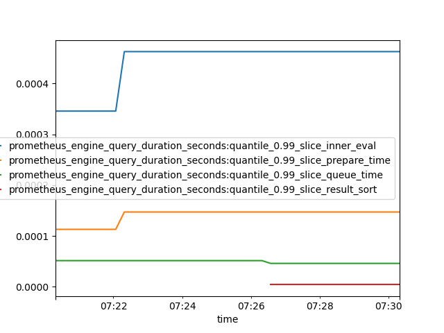

# PYTHON
First install
    
    pip install parides

Now make a simple matplot using data from a prom instance http://...

    from matplotlib import pyplot
    from parides.prom_conv import from_prom_to_df
    df = from_prom_to_df(
        resolution="15s",
        url="http://192.168.1.114:9090",
        metrics_query="prometheus_engine_query_duration_seconds{quantile=\"0.99\"}"
    )
    df.plot()
    pyplot.show()
    

# CLI

The cli writes the response as a CSV file into a subfolder. 
The first row is the timestamp, then an id, each column contains multiple timeseries/feature.
Some Examples: 

**Example 1:** Export all metrics there are from the last 20 minutes to (useless, but doable :-)

    parides http://127.0.0.1:9090 {__name__=~\".+\"} 
        
**Example 2:** Export a subset of the metrics with promql query.

    parides http://127.0.0.1:9090 {__name__=~\"http.*\"} 

**Example 3:** Decrease data by increasing the sample rate to 15 Minutes
  
    parides http://192.168.1.100:9090 {__name__=~\".+\"} \
        -s 2017-04-28T11:50:00+00:00 \
        -e 2017-04-30T12:55:00+00:00 \
        -r 15m

**Example 4:** Query alerts on High Latency only: 

    parides http://192.168.1.100:9090 \
            "sum(ALERTS{alertname=\"APIHighRequestLatencyOnGet\"}) by (host, alertname)"\
             -s 2017-04-28T11:50:00+00:00\
             -e 2017-04-30T12:55:00+00:00\
              -r 500